# 🛡️ Lab 01 — Building a Free Microsoft Security Lab (Azure + Defender for Business + Intune)

> A zero-cost, step-by-step guide to standing up a real Microsoft security environment for
> hands-on SOC/SC-200 practice — no company tenant,no paid subscription
> required beyond standard trial terms.

Most people studying for SC-200 or breaking into a SOC role hit the same wall: enterprise tools
like Defender for Business and Intune feel locked behind a corporate account. They're not.
This guide walks through the exact steps to get a working lab running for free, including the
licensing traps that aren't obvious until you hit them.

---

## 📋 What You'll Set Up

| Component | Purpose |
|---|---|
| ☁️ Azure Free Account | Foundation tenant + USD 200 credit |
| 🛡️ Microsoft Defender for Business (trial) | EDR/endpoint security — the core of this lab |
| 📱 Microsoft Intune Plan 1 (trial) | Device management (see licensing notes below) |
| 🔐 Microsoft Entra ID P2 (trial) | Identity, Conditional Access, advanced identity protection |

---

## 🚀 Step 1: Activate Your Azure Free Account

Go to: **[azure.microsoft.com/get-started/azure-portal](https://azure.microsoft.com/en-au/get-started/azure-portal)**

1. Click **Try Azure for free**
2. **Sign in options:**
   - Already have a Microsoft account? Choose it directly.
   - Need to use a different account, or don't have one? Click **Use another account**

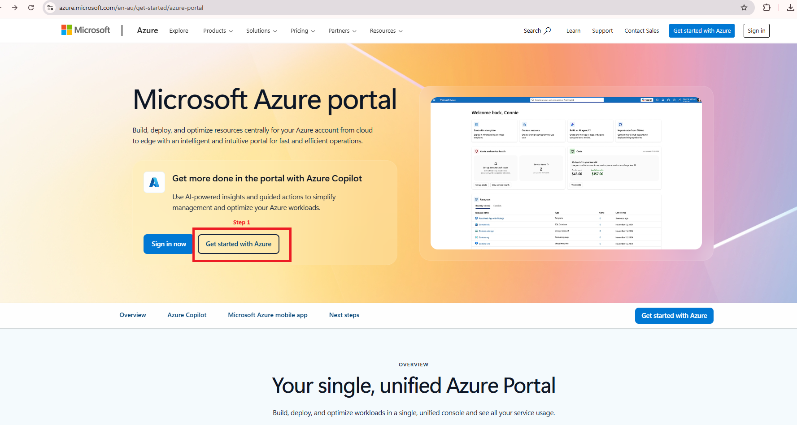
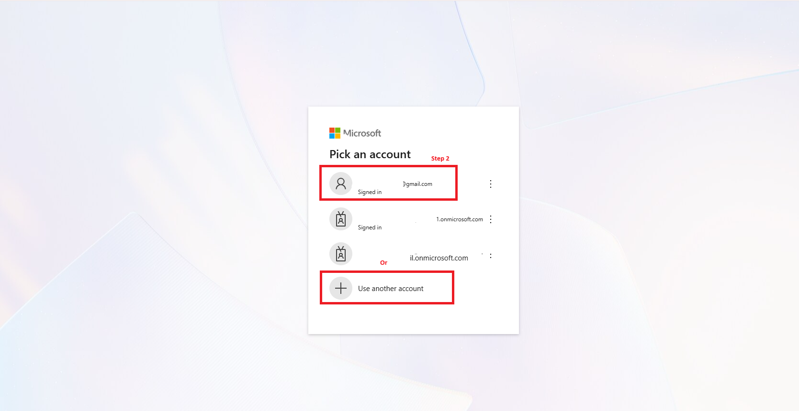

3. *(Assuming you're starting fresh)* Choose **Create account**, then verify your email using the
   verification code Microsoft sends you

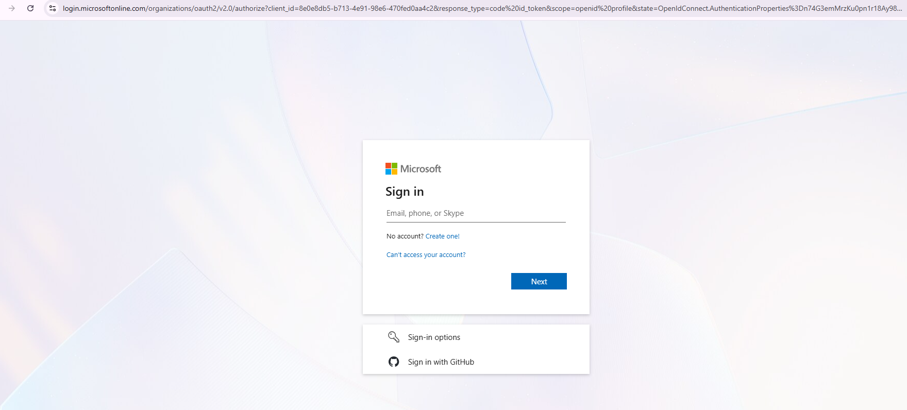

4. Fill in your personal details — **select your country carefully**; this affects billing region
   and available services, and can't be easily changed later

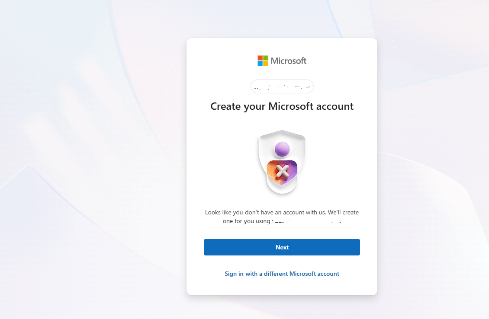

5. Complete the **human verification** step (phone/SMS or similar)

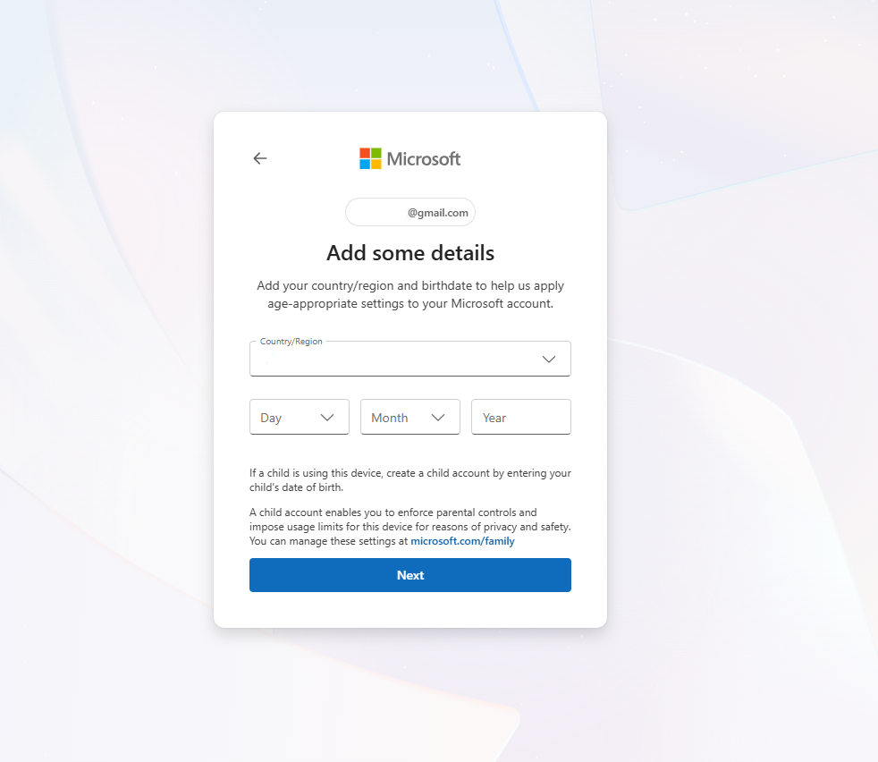

6. Proceed to **create your Azure free account** — fill in your personal details accurately in the
   account creation section

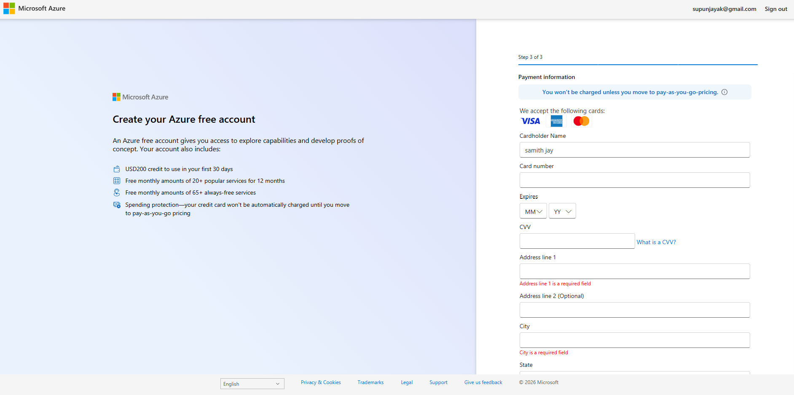
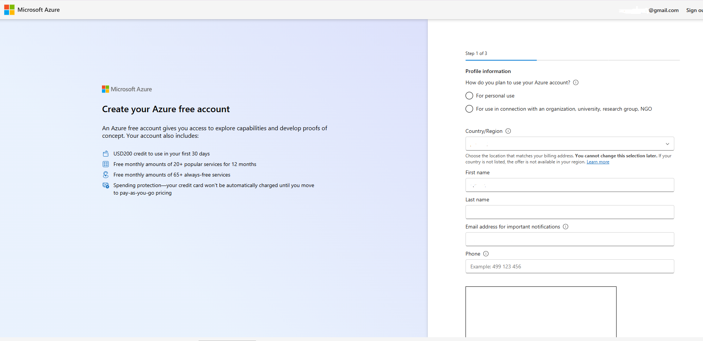
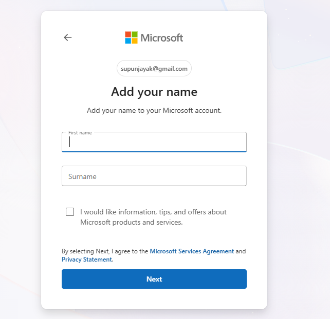

7. Add payment details to finish sign-up

> ⚠️ **Important — you will not be charged.**
> Azure requires a card on file for identity verification, but **you won't be billed automatically**
> unless you explicitly opt in to pay-as-you-go pricing. Spending protection keeps your free
> resources capped by default.

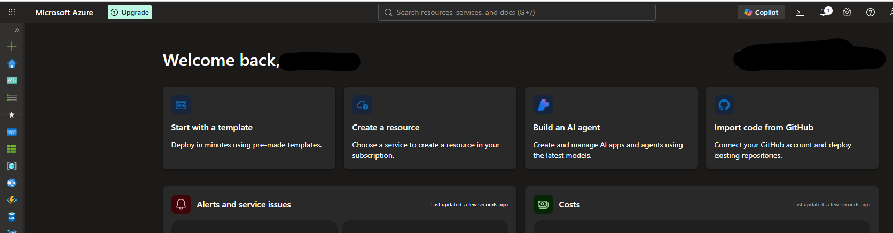

---

## 🎁 What You Get With Azure Free Account

| Benefit | Details |
|---|---|
| 💵 Credit | USD 200 to use in your first 30 days |
| 🆓 Popular services | Free monthly amounts of 20+ popular services for 12 months |
| ♾️ Always-free services | Free monthly amounts of 65+ always-free services |
| 🔒 Spending protection | Your card won't be automatically charged until you move to pay-as-you-go |

This gives you enough runway to explore capabilities and build real proofs of concept —
plenty for a security lab.

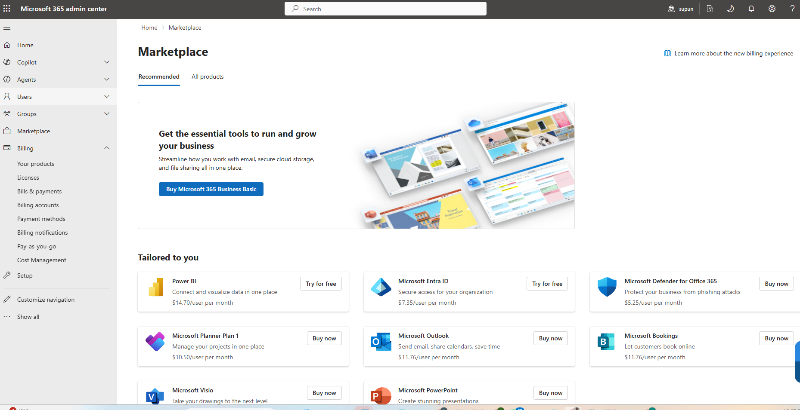

---

## 🔐 Step 2: Activate Your Security Trial Licenses

Now switch to the **Microsoft 365 admin center**:

**[admin.cloud.microsoft](https://admin.cloud.microsoft/?#/homepage) → Marketplace**

### 🛡️ Microsoft Defender for Business

1. Search the Marketplace for **Microsoft Defender for Business**

> 💡 **Why this one specifically:** Other Defender SKUs (Defender for Office 365, Defender for
> Cloud, etc.) can incur cost immediately or require additional configuration. Defender for
> Business is the right starting point for a free lab — it's built for smaller environments and
> its trial is genuinely free for the trial period.

2. Click **Activate trial**

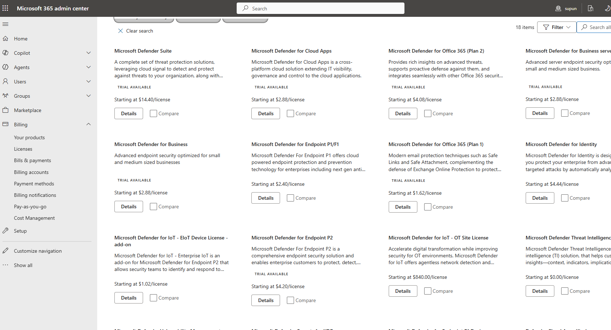
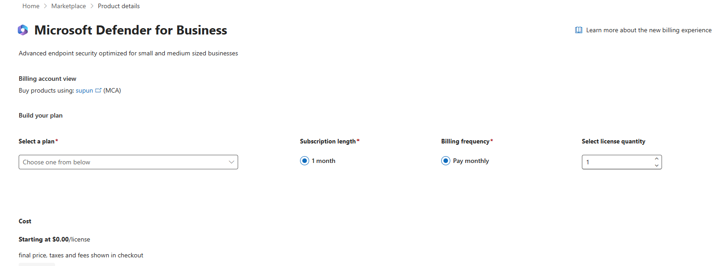

### 📱 Microsoft Intune Plan 1

Go back to the Marketplace and search for **Microsoft Intune Plan 1**. Inside that listing,
you'll be asked to choose between two variants:

- **Microsoft Intune Plan 1 (trial)** — per-user licensing
- **Microsoft Intune Plan 1 Device** — per-device licensing

**Comparison table — know which one you actually need before activating:**

| Feature | Microsoft Intune Plan 1 | Microsoft Intune Plan 1 Device |
|---|---|---|
| **License type** | Per user | Per device |
| **Who is licensed?** | A user | A device |
| **Best for** | Employees who use one or more devices | Shared or kiosk devices |
| **Number of devices** | One licensed user can enroll multiple devices (subject to Microsoft's limits) | Only the licensed device |
| **User features** | Yes | Limited |
| **Typical use** | Company laptops, personal phones, tablets | Reception PCs, meeting room PCs, digital signage, classroom devices |

For a personal lab where you're testing device compliance and enrollment on your own devices,
**Intune Plan 1 (per user)** is almost always the right choice — it lets one license cover
multiple devices (your VM *and* your phone), unlike the Device variant.

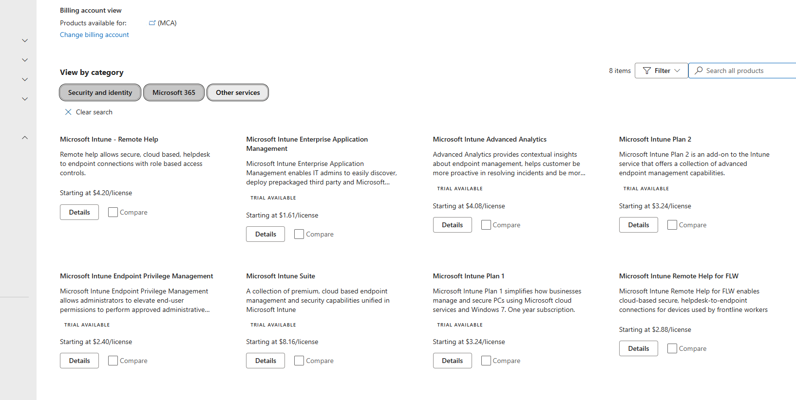
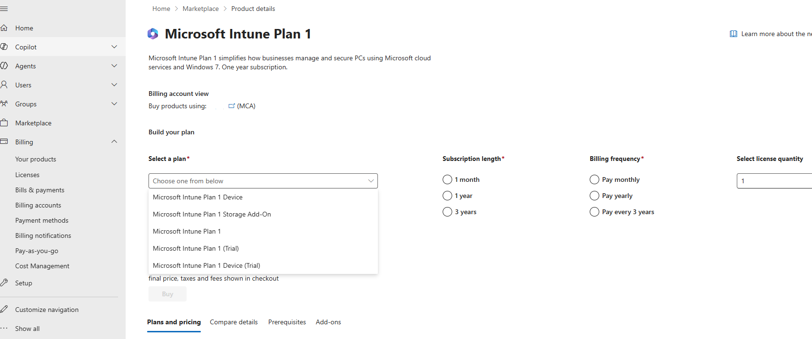

### 🔑 Microsoft Entra ID P2

Same process — search the Marketplace for **Microsoft Entra ID P2** and activate the trial.
This unlocks Conditional Access, Identity Protection, and advanced identity features you'll
want for later labs (Conditional Access policies tied to device compliance, risk-based sign-in, etc.)

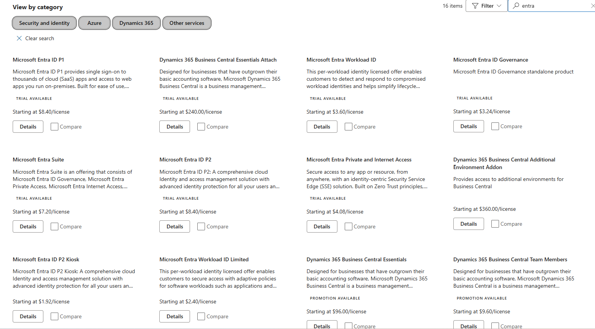
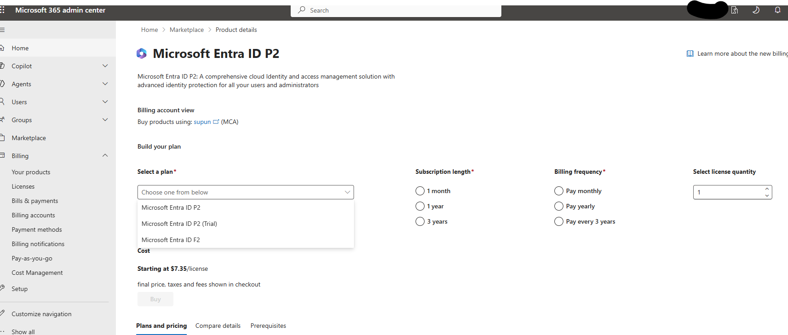

---

## ⚠️ Critical Licensing Lesson (Learned the Hard Way)

> **Defender for Business standalone does NOT include Intune**, even though both appear in
> the same Marketplace and admin center. They are separate products with separate licenses.
>
> If you activate *only* Defender for Business and then try to enroll a device into Intune MDM,
> you'll hit a wall of confusing errors (`CAA50024`, blank MDM URLs, "device management could not
> be enabled") that look like configuration mistakes but are actually a licensing gap.
>
> **Fix:** Make sure you've explicitly activated the **Intune Plan 1** trial separately (above)
> don't assume Defender for Business licensing covers it.
>

---

## ✅ What's Next

With all three trials active, you're ready to onboard your first devices and start generating
real security telemetry.

→ Continue to **[Lab 02: Device Onboarding](../02-device-onboarding/)**

---

[Back to Profile](https://github.com/supunkaru) | [Other Labs](../)
